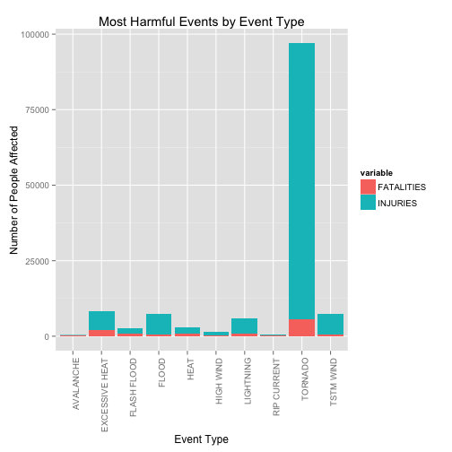
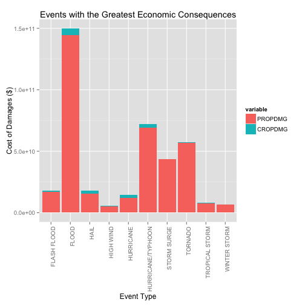

The Impact of Storms and Severe Weather Events With the Most Impact on the Economy and Public Health of the United States
========================================================

# Synopsis
### Storms and other severe weather events can cause both public health and economic problems for communities and municipalities. Many severe events can result in fatalities, injuries, and property damage, and preventing such outcomes to the extent possible is a key concern.  This project will use the U.S. National Oceanic and Atmospheric Administration's (NOAA) storm database to examine the fatalities and damage of storms and severe weather events in the US. The data will be downloaded to analyze:

#### *1. Across the United States, which types of events (as indicated in the EVTYPE variable) are most harmful with respect to population health?*

#### *2. Across the United States, which types of events have the greatest economic consequences?*

### The dataset given is very large ([additional information](https://d396qusza40orc.cloudfront.net/repdata%2Fpeer2_doc%2Fpd01016005curr.pdf)), so the analysis will be limited to just pertinent variables to identify the damage storms and severe weather have across the US and what will have the greatest economic and public health impacts.

# Data Processing
### First, we obtain the original dataset, which is located [here](https://d396qusza40orc.cloudfront.net/repdata%2Fdata%2FStormData.csv.bz2).

### It will need to be unzipped and read in:

```r
## Set wd
setwd("~/RepData_PeerAssessment2")

## Download and read in file
fileUrl <- "https://d396qusza40orc.cloudfront.net/repdata%2Fdata%2FStormData.csv.bz2"
download.file(fileUrl, destfile = "repdata.csv.bz2", method = "curl")
stormdf <- read.csv("repdata.csv.bz2")
```

#### *The stormdf data contains 902,297 observations of 37 variables.*

### To answer the first question, *Across the United States, which types of events (as indicated in the EVTYPE variable) are most harmful with respect to population health?*, we will need to examine both fatalities (FATALITIES) and injuries (INJURIES) by event type (EVTYPE).

### Since the dataset is so large, we will limit to the top 10 event types by fatalities and injuries in a smaller dataset called harmful.

```r
# Aggregate event type by fatalities and injuries (added up to contain 1 row per event)
harmful_large <- aggregate(cbind(FATALITIES, INJURIES) ~ EVTYPE, stormdf, sum)

# Ensure you have the right packages and limit to the top 10 event types
require(reshape2)
```

```
## Loading required package: reshape2
```

```
## Warning: package 'reshape2' was built under R version 3.1.2
```

```r
harmful <- melt(head(harmful_large[order(-harmful_large$FATALITIES, -harmful_large$INJURIES), ], 10))
```

```
## Using EVTYPE as id variables
```

### To answer the second question, *Across the United States, which types of events have the greatest economic consequences?*, we will need to examine both property damage (PROPDMG) and crop damage (CROPDMG) by the event type (EVTYPE).

### The damage values need to be cleaned and recoded into numeric values by their exponential variables, PROPDMGEXP and CROPDMGEXP.  This will be done using the car package.  Then, since the dataset is still large, the data will be limited to the top 10 economic consequences in a dataset named economic.

```r
# Ensure you have the right packages installed
require(car)
```

```
## Loading required package: car
```

```
## Warning: package 'car' was built under R version 3.1.3
```

```r
# Recode variables
stormdf$PROPDMG <- stormdf$PROPDMG * as.numeric(Recode(stormdf$PROPDMGEXP, 
    "'0'=1;'1'=10;'2'=100;'3'=1000;'4'=10000;'5'=100000;'6'=1000000;'7'=10000000;
    '8'=100000000;'B'=1000000000;'h'=100;'H'=100;'K'=1000;'m'=1000000;'M'=1000000;
    '-'=0;'?'=0;'+'=0", 
    as.factor.result = FALSE))
stormdf$CROPDMG <- stormdf$CROPDMG * as.numeric(Recode(stormdf$CROPDMGEXP, 
    "'0'=1;'2'=100;'B'=1000000000;'k'=1000;'K'=1000;'m'=1000000;'M'=1000000;
    ''=0;'?'=0", 
    as.factor.result = FALSE))

# Create economic dataset
economic_large <- aggregate(cbind(PROPDMG, CROPDMG) ~ EVTYPE, stormdf, sum)
economic <- melt(head(economic_large[order(-economic_large$PROPDMG, -economic_large$CROPDMG), ], 10))
```

```
## Using EVTYPE as id variables
```

# Results

### 1. Across the United States, which types of events (as indicated in the EVTYPE variable) are most harmful with respect to population health?
### The below stacked bar plot will show the most harmful events by event type.  The harm will be shown by the number of people affected by the event.  By stacking the fatalities and injuries, we can see the most harmful event in total. 

```r
#Ensure you have the right package for plots
library(ggplot2)
```

```
## Warning: package 'ggplot2' was built under R version 3.1.3
```

```r
# Create Stacked Bar Plot
ggplot(harmful, aes(x=EVTYPE, y=value, fill=variable)) + 
    geom_bar(stat="identity")+ labs(x = "Event Type", y = "Number of People Affected") + ggtitle("Most Harmful Events by Event Type")+ theme(axis.text.x = element_text(angle = 90, hjust = 1))
```

 
### *As you can see from the plot, Tornadoes are the most harmful event with respect to population health.*

### 2. Across the United States, which types of events have the greatest economic consequences?
### The below stacked bar plot will show the greatest economic consequences by event type.  The cost of the damages is shown in dollars.  By stacking the property damage and the crop damage, we can see the costliest event in total. 

```r
# Create stacked bar plot
ggplot(economic, aes(x=EVTYPE, y=value, fill=variable)) + 
    geom_bar(stat="identity")+ labs(x = "Event Type", y = "Cost of Damages ($)") + ggtitle("Events with the Greatest Economic Consequences")+ theme(axis.text.x = element_text(angle = 90, hjust = 1))
```

 
### *As you can see from the plot, flooding is the event type with the greatest economic consequence based on the cost of damages.*
